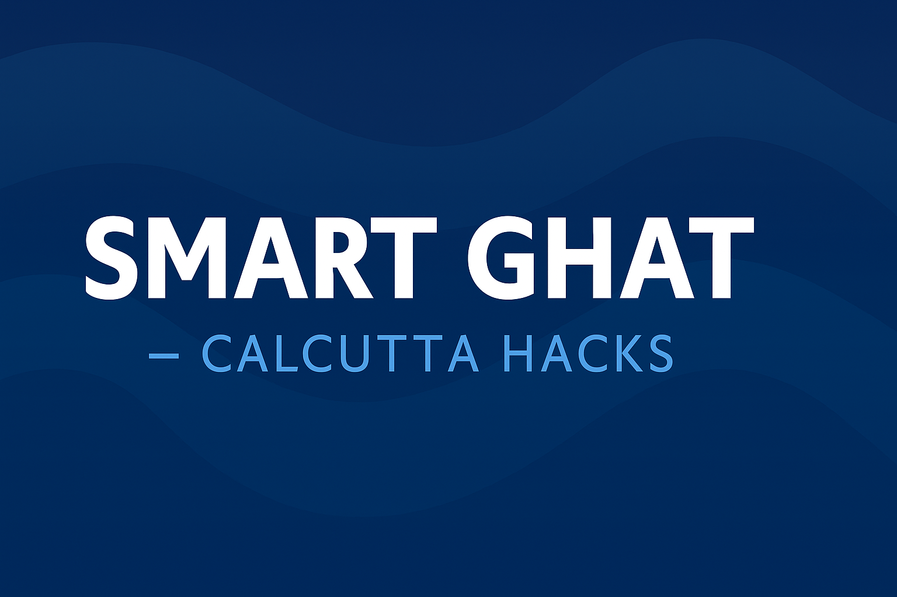
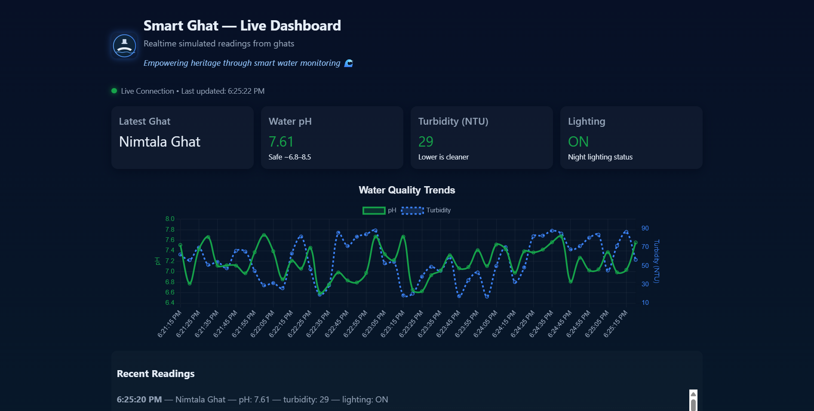

🌊 Smart Ghat — IoT + Citizen Engagement Platform

Project for Calcutta Hacks 2025  
Built with ❤️ by Team 404FoundUs

Empowering heritage through smart water monitoring and citizen participation.

📖 Overview

Smart Ghat is an IoT + Web based system designed to monitor the real-time health of river ghats (like Babughat, Princep Ghat etc.) and empower citizens to report cleanliness, lighting, and pollution issues directly from their mobile devices.  

The project bridges ‘hardware sensors’ (for water pH, turbidity, lighting, and temperature) with a ‘live web dashboard’ and an ‘interactive citizen portal’ — making ghats smarter, cleaner, and safer.

💡 Key Features
🧠 Admin Dashboard
- Real-time visualization of ghat sensor data (pH, turbidity, lighting)
- Dynamic charts updating from IoT simulator or Arduino sensors
- Smart alerts for unsafe pH or high turbidity
- Mobile-friendly dark UI built using React + Chart.js

👥 Citizen Portal
- Modern, mobile-first interface for citizens to:
- Submit feedback or report issues  
 		- Capture or upload photos from camera/files  
- Auto-capture GPS location for reports  
- Choose issue type (Cleanliness, Drain Blockage, Lighting, etc.)
- Reports displayed instantly with live preview
- Toast notifications for success/error feedback

🔌 Hardware (IoT Integration)
- Arduino UNO-based sensor node with:
- pH sensor  
- Turbidity sensor  
- LDR for lighting  
- Optional temperature sensor  
- Sends JSON data to the Express backend via Python serial bridge

🚀 Quick Setup Guide

1️⃣ Clone the Repository
git clone https://github.com/kuntal131204/Smart-Ghat-CalcuttaHacks.git
cd Smart-Ghat-CalcuttaHacks
2️⃣ Setup Backend
cd backend
npm install
npm start
Backend will start on:🔗 http://localhost:5000

3️⃣ Setup Frontend
cd ../frontend
npm install
npm run dev
Frontend runs on:🔗 http://localhost:5173

Access:
Admin Dashboard: /
Citizen Portal: /citizen

🧪 IoT Simulator (Software mode)
If no Arduino connected, simulate live data:

cd iot_simulator
python simulate_data.py
This sends fake sensor readings every few seconds to /data.

⚙️ Arduino Bridge (Hardware mode)
python arduino_bridge.py
Ensure you update:
PORT = "COM3"  # change to your Arduino port

📱 Citizen Portal URL
Once frontend is running:
http://localhost:5173/citizen
or from mobile (same Wi-Fi):
http://<your-pc-ip>:5173/citizen

🧰 Tech Stack
Layer	Tools / Frameworks
Frontend	React, Vite, Chart.js, React-Toastify, React-Icons
Backend	Node.js, Express, Multer, CORS
Hardware	Arduino UNO, pH Sensor, Turbidity Sensor, LDR
Communication	Serial + REST API
Visualization	Dynamic charts, live cards, dark theme UI

📸 Screenshots

📊 Live Dashboard				

👥 Citizen Portal

🌍 Future Enhancements
•	Real database (MongoDB / Firebase)
•	Map view with live cleanliness score per ghat
•	AI-based water quality prediction
•	Public leaderboard for best-maintained ghats
•	Multi-language support for citizens

🧑‍💻 Team
Member	Role
Kuntal Ghosh	Full-stack / IoT Integration
Diptodeep Biswas	UI/UX & Frontend
Keshav Dutta	Hardware & Sensors
Irisha Karan	Data & Analytics

🏁 License
MIT License © 2025 Smart Ghat Team
